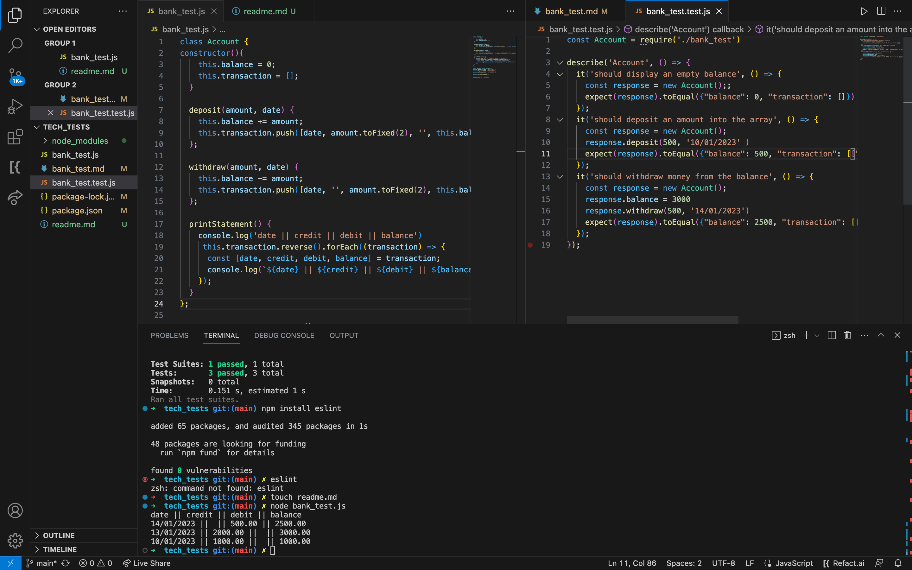

# Bank Tech Test

The program is built with two default states, a balance and a transaction. The balance is manipulated by two methods, withdraw and deposit, that will either add or subtract from the balance. Each of these methods then takes the behaviour performed and stores in within the transactions to be accessed later with a date, amount deposited or withdrawn, and an updated balance based on that. The third method then loops over each of the transactions to display them to the user

## How to set-up

Firstly, run **npm install -g jest**

Then run **Jest** in the terminal to see each of the tests.

To run the code in the terminal, type **node bank_test.js**

## My Approach

I intially set-up my project to be barebones. It had three basic methods that would simply return a value to meet the test criteria. 

As the code expanded in complexity I had to alter my tests and my code to meet the requirements of the task.

## My Structure 

My code has a simple structure with three methods and two variables that are made on start with defualt values. These can then be maninpulated by the withdraw and deposit method and then transactions can be listed to display that history by using the printStatement method.

